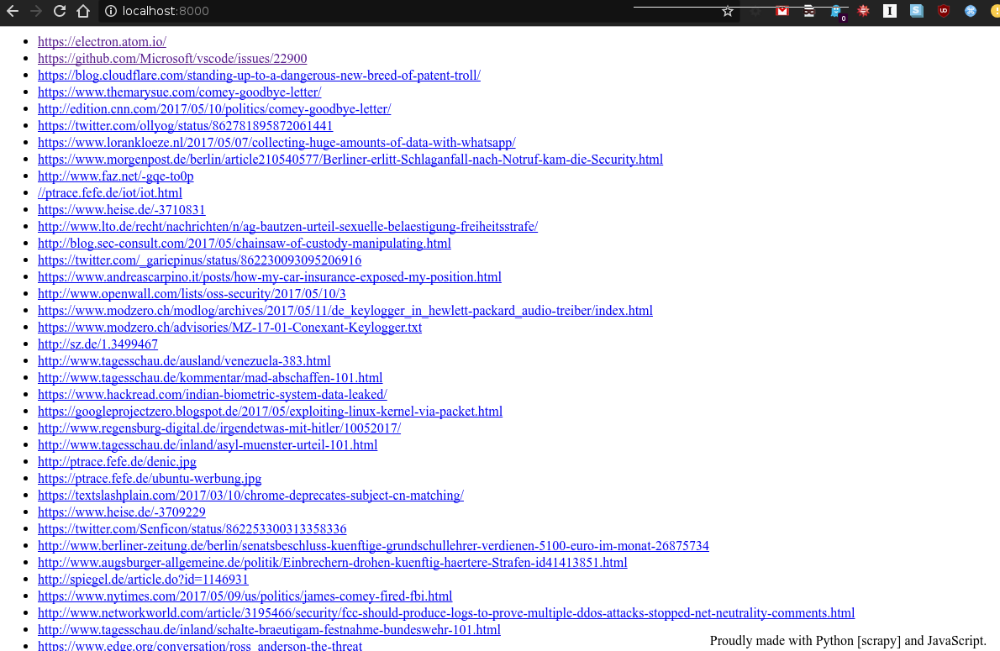

## dietfefe
blog.fefe.de - refined

### why?
One late summer night over cocktails, a few friends and myself arrived at
the conclusion that, "fefe's blog" isn't worth looking at for anything else
than the actual URLs -- mostly sent by other people anyway -- as the content 
and comments are hugely annoying, often technically false and mostly contain
[F.U.D](https://en.wikipedia.org/wiki/Fear,_uncertainty_and_doubt).


Consequently, I wrote this in a few minutes on my way to bed - 'njoy!

### how?
1. `git clone https://github.com/azet/dietfefe.git`
2. `cd dietfefe ; pip install scrapy`
3. `scrapy crawl fefe`
4. `cd web/ ; python -m SimpleHTTPServer`
5. point browser to `http://localhost:8000` (see below to host on a webserver)

alternatively you could set up `scrapyd` or a cronjob on any webserver.
it's fairly simple to do postprocessing and follow up analysis of parsed
URLs with scrapy, that's why I've chosen it, nothing yet implemented though.

### screenshot / demo


## License
http://opensource.org/licenses/MIT

```
The MIT License (MIT)

Copyright (c) 2014-2017 Aaron Zauner <azet@azet.org>

Permission is hereby granted, free of charge, to any person obtaining a copy
of this software and associated documentation files (the "Software"), to deal
in the Software without restriction, including without limitation the rights
to use, copy, modify, merge, publish, distribute, sublicense, and/or sell
copies of the Software, and to permit persons to whom the Software is
furnished to do so, subject to the following conditions:

The above copyright notice and this permission notice shall be included in
all copies or substantial portions of the Software.

THE SOFTWARE IS PROVIDED "AS IS", WITHOUT WARRANTY OF ANY KIND, EXPRESS OR
IMPLIED, INCLUDING BUT NOT LIMITED TO THE WARRANTIES OF MERCHANTABILITY,
FITNESS FOR A PARTICULAR PURPOSE AND NONINFRINGEMENT. IN NO EVENT SHALL THE
AUTHORS OR COPYRIGHT HOLDERS BE LIABLE FOR ANY CLAIM, DAMAGES OR OTHER
LIABILITY, WHETHER IN AN ACTION OF CONTRACT, TORT OR OTHERWISE, ARISING FROM,
OUT OF OR IN CONNECTION WITH THE SOFTWARE OR THE USE OR OTHER DEALINGS IN
THE SOFTWARE.
```
